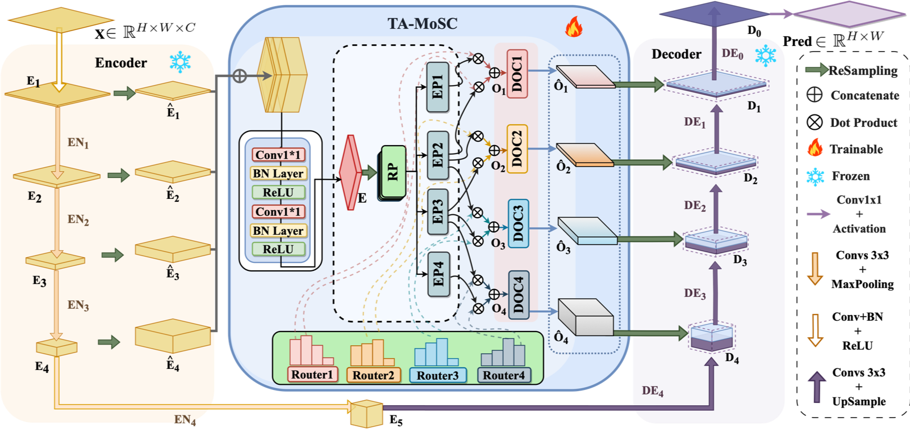

# UTANet: Task-Adaptive Mixture of Skip Connections for Enhanced Medical Image Segmentation
<div align="left" style="line-height: 1;">
  <a href="" style="margin: 2px;">
    
  </a>
  <a href="" style="margin: 2px;">
    
  </a>
</div>

#### Official Pytorch Implementation


## 📌 Introduction
UTANet is a U-Net-based architecture enhanced with the **Task-Adaptive Mixture of Skip Connections (TA-MoSC)** module. By integrating the Mixture of Experts (MoE) framework into skip connections, our method dynamically aligns encoder-decoder features, addressing dataset-specific segmentation challenges. Key contributions include:

- **TA-MoSC**: Adaptive routing mechanism for multi-scale feature fusion.
- **Balanced Expert Utilization (BEU)**: Ensures balanced training of lightweight convolutional experts.
- **State-of-the-art Performance**: Outperforms existing methods on GlaS, MoNuSeg, Synapse, and ISIC16 datasets.

## ✨Highlights
- **Dynamic Skip Connections**: Replaces fixed skip connections with task-adaptive expert mixtures.
- **Lightweight Design**: Minimal parameter overhead compared to vanilla U-Net.
- **Multi-Dataset Generalization**: Robust performance across diverse medical imaging tasks.
- **Code Efficiency**: Compatible with PyTorch and easy to integrate into existing U-Net variants.

## 🚀Quick Start
#### Installation
1. Clone the repository
```shell
git clone https://github.com/AshleyLuo001/UTANet.git  
cd UTANet
```
2. Install dependencies
```bash
pip install -r requirements.txt
```
3. Training

waiting...

## 📊Results
#### Performance on Medical Image Segmentation Datasets
waiting...


## 📜Citation
#### If you use UTANet in your research, please cite:
```bibtex
@article{luo2025rethinking,  
  title={Rethinking U-Net: Task-Adaptive Mixture of Skip Connections for Enhanced Medical Image Segmentation},  
  author={Luo, Zichen and Zhu, Xinshan and Zhang, Lan and Sun, Biao},  
  journal={AAAI},  
  year={2025}  
}
```


### ✨ Star this repo if you find it helpful!
